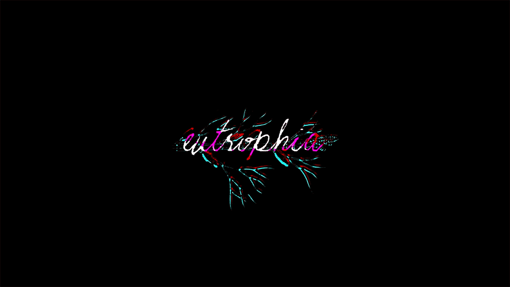
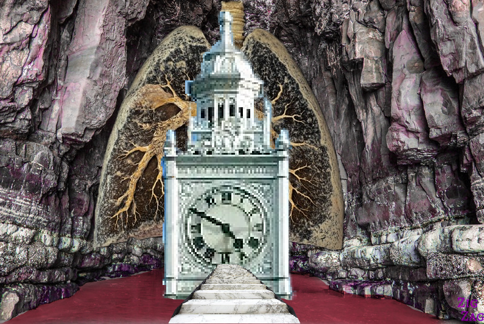
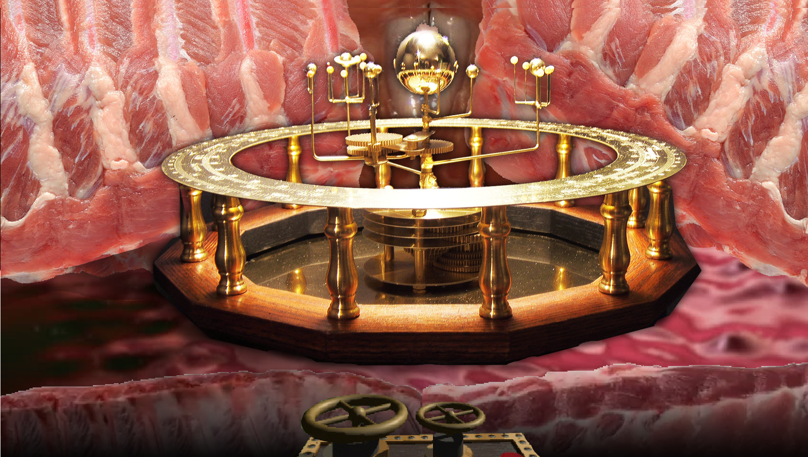
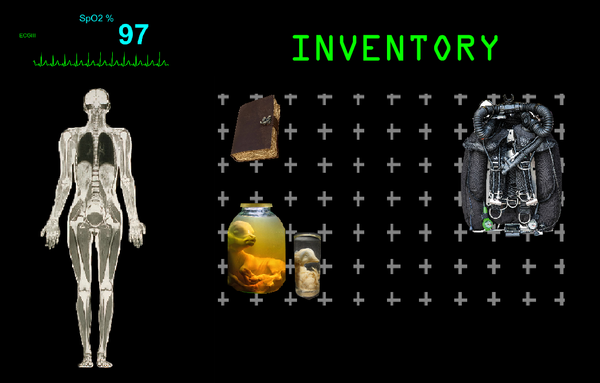

# **eutrophia**

[Watch pitch trailer here](https://www.youtube.com/watch?v=1u6rPjjJoxo)

*The term "**eutrophication**" comes from the Greek **eutrophos**, meaning "**well-nourished**", [7] because the waterway has had an excessive amount of nutrients [such as nitrogen], contributing to overgrowth [...] it eventually strangulates the oxygen out [...]*

THE OLD WORLD IS DYING. THE NEW WORLD IS STRUGGLING TO BE BORN.
SHED YOUR SKIN AND MEET IT.

## **Deliverables:**
- Complete Game Design Document (3000-4000 words)
- Visual mockups/concept art (minimum 5 images)
- Technical specification document

## **GDD Structure**
### **Executive Summary**
An unknown beam shot from the heart of Andromeda turned the seas to blood and made the buildings of man come alive and spiral downward into the Earth. Air on the surface is no longer livable, owing to the blood-red bloom of a xenoalgae that's aggressively colonized the oceans and turned the rains acidic, off-gassing nitrogen and carbon monoxide. After two centuries under these conditions, a new sort of society has emerged in the living bowels of the Earth. 

Within the increasingly-organic subterranean cathedrals, offices, and houses that you call home, a theory has begun to emerge that the wall-eyes - strange teratoma-like growths that have begun developing inside the walls - are becoming decidedly more human as one approaches the suffocating surface. You escaped the last expedition meant to document this, a group of four-turned-three armed with re-breathers,  sledgehammers, and body-bags. You will not escape this one.

 Your assignment: to trudge alone armed only with an ultrasound tool, a scapel, and a journal. Head towards the surface. Solve Blockages. Excise Wall-Eyes. Document their features. Do not return until you have found the reason for the failure of the expedition you abandoned.

### Target audience
Ages 16+, with a particular pull towards marginalized gender identities.

This is a caving puzzle/exploration game, and the work is intended to play on anxieties about the body as an object and the identities that emerge from it; as such, I imagine it would appeal particularly well to young women and members of the transgender community who are horror fans. Anyone who'd ever click on a video essay titled 'Visceral Femininity in Bloodborne' - this one's for you.

Comparative works of media with similar themes and audience draws are Mouthwashing by Wrong Organ (game), Anatomy by Kitty Horrorshow (game), Pathologic 2 by Icepick Lodge (game), BLAME! by Tsutomu Nihei (manga), The Southern Reach book series by Jeff Vandermeer (book series), and The Haunting of Hill House by Shirley Jackson (book). Puzzles are meant to be inspired by the Myst (game) series. 

### Platform and technical requirements
Windows. It should be able to run on an average gaming laptop (8-16GB RAM; dedicated graphics card of the Nvidia 10 series or later). Maximum 20GB in size.
### Development timeline estimate

### **Game Overview**
#### Core gameplay mechanics
**Puzzles:** Called 'Blockages' in-universe. Solving grown Blockages is the only way to press forward. Blockages often resemble man-made structures, though no man ever made them, and it is difficult to discern what - if any - practical use they provide other than to delay one's ascent to the surface. Examples of documented Blockages include turning dials to align shifting plates on a clock's face to reveal a gap that can be crawled through and placing stone spheres in the correct order on a series of scales so their balances align to allow a person to walk across them.

**Ultrasounding:** In soft spots in the walls, you should use your portable ultrasound pack to check for wall-eyes. Switch to this tool using the [3] key, and then left-click on the wall.

**Scapel:** Used on exposed soft areas in walls to cut them open, bring a Wall-Eye into the world.

**Oxygen:** %SpO2. A measurement of your blood oxygen. Exerting yourself by moving heavy objects or running uses up Oxygen and can leave you choking for air. Critically low levels of Oxygen will blur and darken the screen; a Game Over can be triggered by suffocation. Try moving deeper into the Earth to catch your breath; the closer to the surface you get, the less replenishing your breaths will be - and the more the high CO will trigger Panic...

**Panic:** Panic increases your rate of respiration and can shrink the Oxygen bar at high levels. Panic increases in tight spaces, in high CO areas, in the dark, and during certain scripted events. Completing puzzles decreases Panic. Excising Wall-Eyes can decrease or increase Panic.

**Journal:** Press [J] to open. Document your findings thusfar. Takes notes on the puzzles. Journalling usually decreases Panic; note that you can't Journal in tight spaces. Who's been writing all these extra pages of notes?

**Exploration:** Exploration should be rewarding by delivering novel visuals to players and new clues about the story.

### Genre and style
This is a sci-fi horror game, and is intended to be horror *without* jumpscares or enemies to chase you. Just you, the caves, and what lurks within you.
### Unique selling points
The main draw of this game will be the atmosphere and story, as the number of puzzles will be small - about five Blockages to keep scope down. 

While other games that feature unwanted pregnancies exist, I'm not currently aware of a game that centers the point of view *of the person carrying the unwanted pregnancy*. Mouthwashing told its story extremely effectively from (primarily) the POV of the surrounding male characters, but I was left with a desire to know more about Anya - not just as a victim, but as a person. While Mouthwashing was driving home a point about men protecting each other in the face of sexual assault accusations and did so with aplomb by focusing on Jimmy and Curly's perspectives, I found myself wanting a game that would give as much time to Anya's mental hellscape - her experiences, the life she came from, the future she was increasingly struggling to imagine for herself. I feel that, given the current political atmosphere in the US and the success of Mouthwashing, there's a sizable market for speaking to these anxieties, as well. Eutrophia is meant to be an answer to that desire.
### Player experience goals
 I imagine this effectively as an 'art puzzle' game along similar lines to the Myst series. While the themes, some mechanics, and art direction will push it in more of a 'horror' direction, there should be no (or minimal) jump scares, and no monsters chasing you. Just you, the living caves, what lurks within you, and the ascent to a poisoned world.

### **Gameplay Mechanics:**
#### Core game loop
The player finds all Wall-Eyes in a given room using the ultrasound/scapel. There are a limited amount of Wall-Eyes in each area (1-2); in order to find more, they must solve Blockages for forward progression. Each new area has new Wall-Eyes at different stages of development and new story objects which will prompt the player to press [J] to 'take notes' and learn the character's perspective.
#### Player actions and controls
[1] - Your hands. Right-click to manipulate an object, such as turning gears for a Blockage. Left-click to put it in your inventory.
[2] - Your mobile ultrasound wand. Right-click on an appropriate area to see what lurks within the wall.
[3] - A scapel. Right-click to cut into walls or other things that need cutting.
[J] - Your Journal. Pulls up a full-screen UI. Right or left click to 'flip' through your pages of notes.
[I] - Your Inventory. Shows you what you're carrying (and an MRI-esque scan of your body). Right click on an object to drop it, or inspect its description.
[WASD] - Movement through the world.
[ctrl] - Crouch.
[space-bar] - Jump.
[Shift] - Sprint.

#### Game systems and interactions
*Movement*:
* The player can move using WASD.
* Jump using [space-bar]; Jumping uses up a small amount of Oxygen
* crouch using [ctrl]
* Sprint using [Shift]; Sprinting uses up Oxygen over time, stopping when the bar is at 20%

*Player stats*:
* Oxygen: The player has a mock oximeter in the upper left corner of their screen at all times, that goes up over time, or goes down during exertion, at high elevations, or with high Panic. Low oxygen darkens and blurs the screen; Oxygen remaining critically low for 15 seconds results in a Game Over.
* Panic: The player has a mock heart-rate UI below their oximeter. A faster heart-rate chews through Oxygen. A player's heart-rate can increase during exertion or times of high Panic, such as dark or narrow spaces.

*Inventory & Equipment*:
* Press [I] to open the inventory. The inventory works on a grid pattern, with different objects taking up different numbers of squares. The re-breather is the largest item in the game.
* Items should have tool-tips that include small notes about the item; clicking on the tooltip could open the Journal.

*Journal*:
* Press [J] to open the Journal. The Journal keeps track of the number of Wall-Eyes you've found (and thus, how close you are to completing the game) and the character's thoughts regarding the last expedition's failures.

*World interaction*:
* The player can interact with quest triggers or Blockage triggers by pressing [E].

#### Progression and rewards
The player progresses through the world by solving puzzles in the form of Blockages. Rewards come in the form of story beats that are disclosed through the character's Journal, which the player must open after each Wall-Eye to mark how many Wall-Eyes they've found and their conditions.
Sparse mechanic rewards will also be delivered in the form of scavenged leavings from the previous expedition; the player can equip a re-breather to increase their Oxygen, or eat found food rations to decrease their Panic.

### **Technical Design:**
#### Engine choice (Unreal Engine 5.6 or Godot 4.4) and justification
Unreal Engine 5.6; for VR capacity and semi-realistic graphics. 
Part of what made Myst and Riven so striking was the strong art direction and the incredible visuals for the time period. Unreal's dedication to realistic rendering would help contribute to this for Eutrophia.
#### Technical requirements and architecture
The game should be able to run on a low-end computer with 8GB RAM and a 10 series Nvidia.
#### Performance targets and optimization considerations
Eutrophia should be optimized with the minimum spec in mind - a Windows 10 computer with 8GB RAM and a 10 series Nvidia. 
#### Platform considerations and deployment strategy
We’re developing for:
* Windows 10 and Windows 11 
* x64 only 

It's, at most, being uploaded to itch.io as a $15 game. I'm not messing around with Steam integration.

### **Art and Audio Direction:**
#### Visual style and art direction
Biopunk / steampunk / fantasy / real-world architecture; 'realism', but within the restrictions of PS2-era graphics to keep asset scope smaller. [Myst managed to be beautiful while being visibly low-res to modern eyes.](https://external-content.duckduckgo.com/iu/?u=https%3A%2F%2Fimg.atlasobscura.com%2F6EuWxWPJMKwvB49ZS7eSBYwV3Ztsik3oNJ4MCFBZVyw%2Frt%3Afit%2Fw%3A1280%2Fq%3A81%2Fsm%3A1%2Fscp%3A1%2Far%3A1%2FaHR0cHM6Ly9hdGxh%2Fcy1kZXYuczMuYW1h%2Fem9uYXdzLmNvbS91%2FcGxvYWRzL2Fzc2V0%2Fcy80YWU3ZTljNS1h%2FNDZhLTRmZWUtYTU0%2FMS1hOGQ3ODQ5ZDQ1%2FMTQ5ODM0NTljNjJi%2FNjg5ODEyYzBfbXlz%2FdHBpYzMuUE5H.png&f=1&nofb=1&ipt=53b72157a4c3798da5f2573bd95abd07f3216c28f42ed843136f6edfd62ca42b)

While some aesthetic sensibilities such as pulsing buildings and veined walls will understandably overlap with Scorn (2022, Ebb Software), the world of Eutrophia is meant to feel 'grounded' in the real world much in the same way that Myst's world - despite the fantastical elements - felt like a 'real' place one could walk around in that made a certain amount of intuitive sense.

While, yes, aliens shot a giant terraforming laser at Earth that turned the seas to blood and made every human-made building into a living structure that endlessly grows downwards (the fantastical elements are there) the way objects, puzzles, and physics itself interact should draw more from our present world than from 'aliens did it'. There might be a giant living clock in the center of a room, but you still need to interact with physical, weighty gears to turn the plates on its face. The interfaces that make themselves apparent to you should remain recognizably human and even 'old-fashioned'.
#### Audio design and music style
*Synth notes and pre-language vocalizations billowed from a vast windpipe carrying dead air.* 

The best musical touch-stones are Thierry Zabolitzeff's Promethee and Anna Holmer's work with Breadwoman & Other Tales. Ideally, music should echo and sound 'airy', with a focus on instruments that convey breath such as members of the woodwind family; experimentation with billows and whatever else is encouraged, we're looking for wind and echoes through empty space. 

A musical moodboard can be found [here](https://www.youtube.com/watch?v=QTLFzly4ifU&list=PLIecGGweOsQwA9z2NpJIv-4ILti6Watai).
#### UI/UX design principles
As the story itself is heavily based in pregnancy horror and the fear of medical exploitation and becoming a colonized body, all UI elements should draw from the visual language of medical UIs. 

Blood oxygen should look like the UI of an oximeter, opening the Inventory should pull up a full-body MRI of a person. Panic could be represented as a an EKG UI. The UI should have a glossy, 'glassy' feel and use Sans serif, ALL-CAPITAL fonts. A combination of modern imaging and old medical UIs such as the THERAC-25 would be particularly ideal, as it would echo the hodgepodge of 'old' and 'modern' architecture throughout the caves.

The sound of interacting with the UI should be surprisingly 'retro', similar to the somewhat harsh/ominous SFX noises of [LSD Dream Emulator](https://www.youtube.com/watch?v=e5oBPsPIG7E) - simultaneously 'crunchy' and audibly synthetic, yet breathy. It's almost as if this medical envisioning of your body is rejecting you, somehow...

### **Level Design**
#### Game world structure
The game world will be almost entirely linear, with small choices given throughout to allow a player to manage their Panic and Oxygen. 

The player should start underneath a rope off a tongue-like ledge and progress forward through various tunnels that will lead them to a Blockage that they will need to resolve before they can continue forward to search for Wall-Eyes. There should be 3-5 Blockages, depending on time and development constraints. 

The player must collect a minimum of 10 Wall-Eyes for their expedition to be allowed back into the settlement; Wall-Eyes are usually found right before or in the chamber of a Blockage, meaning that the player must keep solving puzzles in order to collect the Wall-Eyes they need to finish the game.
#### Level progression
Each blockage should be more complex, as a puzzle, than the last one. Player access to Oxygen will decrease as they progress through each level, and player Panic will increase as they ascend due to the increase in CO displacing Oxygen the closer a player gets to the surface. 
Later puzzles should include physically taxing tasks, such as moving heavy objects or needing the player to run quickly from one spot to another. If we're incorporating VR, the tasks should involve large, fast, repetitive arm movements, such as cranking a wheel to generate electricity, so the character's struggle for breath is echoed in the player's. Tunnels between puzzles should also get narrower to increase character Panic.

#### Environmental storytelling
As the player progresses through the world, they should find small keepsakes and off-sheds from the expedition they abandoned. The player character should comment on these and collect them throughout, prompting the player to open the Journal so the character can take notes on what occurred previously. 

It should be implied late in the game that the character has kept secret that they are two months pregnant out of fear of being forced into motherhood, and had made the mistake of disclosing their discovery to their partner, who was the head scientist leading the expedition. While the player character still hasn't decided what to do about it, their partner's insistence that they tell the council and force an exit from scientific life and become permanently domestic - an insistence that happened against the backdrop of an expedition where they cut the Earth open to collect the meat inside - caused the player character to run off into the depths of the Earth. 

Whether the main character attacked their partner, killed them, or simply ran off is nebulous, but what's on-screen is this: the final Wall-Eye the player extracts in Eutrophia looks like the partner. In fact, it looks exactly like the partner. They're not cognizant, but can breathe the air of the poisoned world just fine. It's up to the player what they want to do about that, if anything. The game ends on that note - identity emerging and being re-made by the environment it's found in.

### **Production Plan**
#### Development phases and milestones
Phase 1: Basic implementation pass
* Deciding on what puzzles should be included
* Rough working UI pass (pressing J should bring up a placeholder journal that can flip between .png pages, pressing I should bring up an inventory that shows what you're currently carrying)
* working mechanics pass (1 should bring up your hands which can interact with gears to rotate them or pick up objects, 2 should bring up a scapel that can be swung and does 'damage' to some regions on a wall but not others, pressing 3 should bring up an ultrasound that displays a .png if a valid region on the wall is right-clicked)
* Rough structure of the tunnels laid out; puzzles not implemented yet, but grey-boxed rooms and tunnels between them should be implemented

Phase 2: Story pass
* Implementation of puzzles/Blockages into world; puzzles should be in a rough working state by this point and successfully block progress if a user has not solved the Blockage yet and allow the player to advance if they have
* Implementation of Wall-Eyes: ultrasounding/scapeling specific areas of the wall should produce a placeholder model for a Wall-Eye which is placed on the floor and can be picked up by pressing E. The user's Journal should update with the number of Wall-Eyes they currently have and a rough draft of their 'findings' of the state of the Wall-Eyes
* Implementation of story objects: What objects the previous expedition left behind should be decided on at this point, clipboards, re-breathers, food rations, scraps of notes or clothing. Pressing E on these dropped objects will add more story notes to the Journal; the object will also take up space in the player's Inventory, which will need to be managed. 

Phase 3: Art pass
* With the finalization of gameplay, the game should now go through an art pass. This will include:
* Creation of UI art assets (2D)
* Creation of final architecture and Blockage assets (3D)
* creation of ultrasounding/scapel/story object assets (3D/2D (for Inventory icon))
* Creation of Wall-Eye assets (3D/2D (for Inventory icon))
* Creation of textures for all 3D models
* Further refinement of writing - for the Journal, for storybeats

#### Resource requirements and team structure
This is an art-heavy game, and will likely need two or three artists and a minimum of two programmers to avoid overtaxing any one individual, three programmers if one programmer is a writer (as I would be if I were involved).
The way I would set it up is:
* 2D texture and icon artist
* 3D artist - dedicated to architecture, level assets
* 3D/2D artist - floater - focus on story object assets, can help with general 2D/3D art where more hands needed
* Programmer - working on implementing movement, mechanics
* Programmer - working on implementing Blockage logic, story checks
* Programmer - floater - works on keying in the UI, and when that's done helps with other tasks that need doing; can be a writer
* Sound designer - Produces the musical pieces and UI/foley sounds for the game.

#### Risk assessment and mitigation strategies
The generously sized-team is designed specifically with the idea of individuals needing more or less work on a given day in mind; if the dedicated 3D architecture artist falls ill, the floater 3D/2D artist can fill in. Likewise, if the programmer working on Blockage logic is hit by a car (God forbid), the floating Writer/Programmer role can fill the gap.
#### Version control and project management strategy
* Git (with Git LFS for large binaries)
* Project members should work on their own branches for their changes and use smart commits; merges should be approved by 1 other teammate
* Perforce for source assets (preferred for binary diffs)

#### Testing and quality assurance approach
Each programmer will be responsible for testing their own code and testing a partner's code that they sign off on merge requests for. They'll need to build and test their changes locally before creating a merge request, and their request can only be merged if their partner also tests and approves their work. With three programmers, this will make for a triangle of programmer A supporting programmer B, programmer B supporting programmer C, and so on. They'll need to test for working story triggers, working Blockage triggers and animations, and working UI elements.

### **Market Analysis (optional)**
#### Competitive analysis
This piece was not designed to be competitive with other games, aside from adding to the conversation within the realm of interactive media regarding reproductive horror. 
#### Target market research
This is an art game and is meant to speak to present reproductive anxieties as a cultural artifact. Research into the present challenges people are facing in regions where reproductive rights have been eroded would be ideal.
#### Monetization strategy (if applicable)
This is an art game. It's intended to be bought once and played as an art and conversation piece. While I am aware of other games with similar themes that then monetized the characters into cute plushies, stickers, etc, I would like to avoid that with Eutrophia. At most, perhaps 3D print figurines of the more iconic architectural Blockages could be sold for people to use as they'd like or keep as keepsakes.

